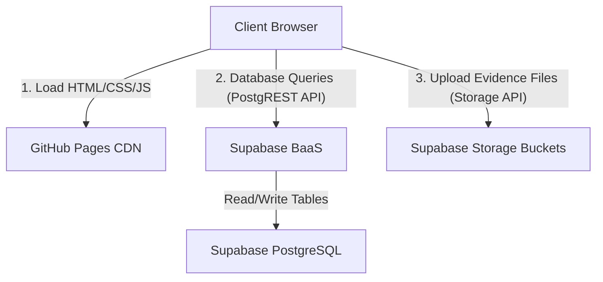

# Systems Architecture & Infrastructure Documentation

This document explains the infrastructure, hosting environments, authentication flow, database integrations, and configuration policies of the **Literacy India Event & Assessment Management Portal**.

---

## 1. Hosting & Deployment Topology

The application operates as a decentralised, client-heavy serverless web app (SPA):

* **Frontend Hosting**: The static site is served via **GitHub Pages CDN**, pulling assets directly from the repository.
* **Backend service**: **Supabase BaaS** provides database queries, binary storage buckets, and serverless authentication controls.

---

## 2. Authentication Flow

Because this portal targets field staff with varying access devices, it implements a highly custom, simplified **direct credentials schema** rather than standard OAuth redirection:

1. **Credentials verification**:
   * The client captures plain text login details (Email and Password) from `pages/login.html`.
   * Queries `public.users` table for match.
2. **Access Control Tokens**:
   * On match, retrieves associated security roles from `public.user_roles`.
   * Stores the session payload (`user_profile` and `user_session`) inside browser `localStorage`.
3. **Session Interceptor**:
   * Every protected view calls `window.Auth.checkSessionRedirect(['role1', 'role2'])` on DOM content load.
   * If session is absent or role checks fail, redirects to `login.html`.

---

## 3. Database Integrations (Supabase client)

All network traffic communicates directly between the browser client and the Supabase API Gateway:

* **Supabase Client Core**: Initialized in `assets/js/supabase.js` using credentials:
  * `SUPABASE_URL`: Project domain API gateway URL.
  * `SUPABASE_KEY`: Public anon key allowing restricted database reads/writes under Row Level Security constraints.
* **REST Data Queries**: Executed via `@supabase/supabase-js` library syntax translating Javascript queries directly to PostgREST endpoints.

---

## 4. Database Security & Row Level Security (RLS)

Security is implemented at the database tier using **PostgreSQL Row Level Security (RLS)** in `database/rls.sql`:

* **Users Table Isolation**: Users cannot modify other users' authentication structures unless authorized under administrative roles.
* **Role Check Policies**:
  * **Super Admin / Prog Admin**: Unrestricted read/write access.
  * **Centre Incharge**: CRUD operations restricted to students, batches, and evidence mapped to their primary `centre_id` (or multiple centres in `user_centres` join mapping).
  * **Judge / Assessor**: Permissions limited to updating scorecards assigned to them under `assessment_assignments`.
  * **Management**: Read-only access across tables.

---

## 5. Storage Buckets (Evidence Uploads)

All digital evidence is hosted inside a dedicated Supabase bucket:

* **Bucket Name**: `evidence-uploads`
* **File Upload Helper**: `pages/evidence.html` uses the Supabase Storage API (`supabase.storage.from()`) to upload image, audio, video, or PDF artifacts directly from the client.
* **Relational Mapping**: Paths returned from Supabase Storage are saved to `public.evidence.storage_path` for relational references.
